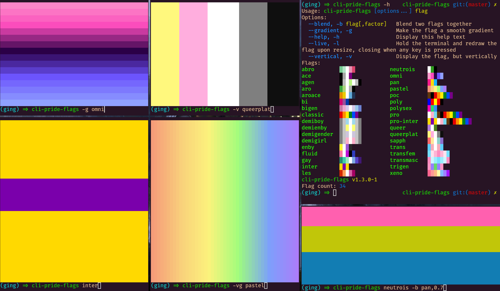

# cli-pride-flags

Displays pride flags in your terminal~

[Click me for a preview!](https://experibass.github.io/flags.html)

# Install
## NPM
`npm i -g cli-pride-flags`

## AUR
There's also a package in the AUR, maintained by `u/rhysperry111`! Install it with your favorite AUR helper: `cli-pride-flags`

## From cloned repo
`npm i .`

# Usage

`cli-pride-flags [options] [flag]`
Options:
  -h    Display the help text
  -l    Hold the terminal open and redraw the flag upon resize, closing when any key is pressed

- Flag is the name of the flag-- for example, you could input bi, trans, transfem, etc.
Example: `cli-pride-flags -d trans` would display the trans flag and hold the terminal.

# Screenshots

Theres a page displaying all the flags on my site [here :3](https://experibass.github.io/flags.html)

Some screenshots in my terminal are below!

# Issues

none :D

# TODO
- Gradient? (I don't think chalk supports gradients, id need a alternative...)
